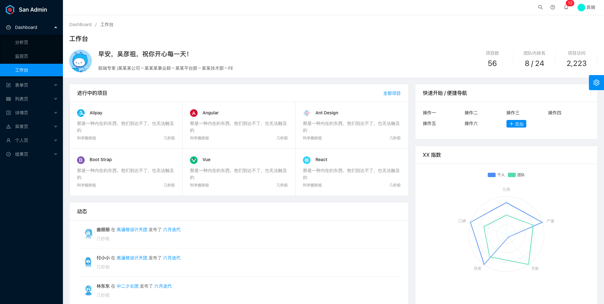

# 布局

页面整体布局是一个产品最外层的框架结构，往往会包含导航、页脚、侧边栏、通知栏以及内容等。在页面之中，也有很多区块的布局结构。在真实项目中，页面布局通常统领整个应用的界面，有非常重要的作用。

## San Admin 的布局



在 San Admin 中，我们抽离了使用过程中的通用布局，都放在 `components/BasicLayout` 目录中，分别为：

* BasicLayout：包含SiderMunu，Header，Footer组件的一个重型布局组件

* GlobalFooter：全局的 Footer 组件
* GlobalHeader：全局的 Header 组件
* PageContainer：包含面包屑的布局组件
* SettingDrawer：抽屉组件，用于可视化配置页面布局
* SiderMenu：侧边栏组件
* TopNavHeader：Nav 组件

## 如何使用 San Admin 布局

通常布局是和路由系统紧密结合的，San Admin 的路由使用了 [San Router](https://github.com/baidu/san-router) 的路由方案，为了统一方便的管理路由和页面的关系，我们将配置信息统一抽离到 `config/routes.js` 下，通过如下配置定义每个页面的布局：

```js
const routes = [
    {
        rule: '/',
        hideInMenu: true,
        Component: () => import('/src/pages/dashboard/analysis'),
        name: '欢迎',
        icon: 'smile'
    },
    {
        rule: '/dashboard',
        name: 'Dashboard',
        icon: 'dashboard',
        children: [
            {
                rule: '/dashboard/analysis',
                Component: () => import('/src/pages/dashboard/analysis'),
                name: '分析页',
                root: '首页',
            },
            {
                rule: '/dashboard/monitor',
                Component: () => import('/src/pages/dashboard/monitor'),
                name: '监控页',
                root: '首页',
            },
            {
                rule: '/dashboard/workplace',
                Component: () => import('/src/pages/dashboard/workplace'),
                name: '工作台',
                root: '首页',
            },
        ]
    },
    {
        rule: '/form',
        name: '表单页',
        icon: 'form',
        children: [
            {
                rule: '/form/basic-form',
                name: 'basic-form',
                Component: () => import('/src/pages/form/basic-form'),
                name: '基础表单',
                root: '首页',
            },
            {
                rule: '/form/step-form',
                name: 'step-form',
                Component: () => import('/src/pages/form/step-form'),
                name: '分步表单',
                root: '首页',
            },
            {
                rule: '/form/advanced-form',
                name: 'advanced-form',
                Component: () => import('/src/pages/form/advanced-form'),
                name: '高级表单',
                root: '首页',
            },
        ]
    }
];

export default routes;
```

映射路由和页面布局（组件）的关系如代码所示，完整映射转换实现可以参看 [routes.js](https://github.com/ecomfe/san-admin/blob/master/src/config/routes.js)。

