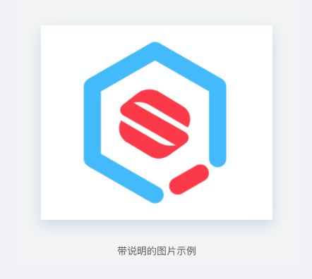

# 新增业务组件

对于一些可能被多处引用的功能模块，建议提炼成业务组件统一管理。这些组件一般有以下特征：

- 只负责一块相对独立，稳定的功能；
- 没有单独的路由配置；
- 可能是纯静态的，也可能包含自己的 state，但不涉及 dva 的数据流，仅受父组件（通常是一个页面）传递的参数控制。

下面以一个简单的静态组件为例进行介绍。假设你的应用中经常需要展现图片，这些图片宽度固定，有一个灰色的背景和一定的内边距，有文字介绍，就像下图这样：



你可以用一个组件来实现这一功能，它有默认的样式，同时可以接收父组件传递的参数进行展示。

## 新建文件

在 `src/components` 下新建一个以组件名命名的文件夹，注意首字母大写，命名尽量体现组件的功能，这里就叫 `ImageWrapper`。在此文件夹下新增 san 文件及样式文件（如果需要），命名为 `index.san` 和 `index.less`。

你的代码大概是这个样子：

```html
<template>
    <div class="imageWrapper">
        
      	{{desc}}
    </div>
</template>

<script>
export default {
	initData() {
		return {
			// ...
		}
	}
}
</script>

<style lang="less" scoped>
.imageWrapper {
  padding: 0 20px 8px;
  background: #f2f4f5;
  width: 400px;
  margin: 0 auto;
  text-align: center;
}

.img {
  vertical-align: middle;
  max-width: calc(100% - 32px);
  margin: 2.4em 1em;
  box-shadow: 0 8px 20px rgba(143, 168, 191, 0.35);
}
</style>
```

到这儿组件就建好了。

## 使用

在要使用这个组件的地方，按照组件定义的 API 传入参数，直接使用就好，不过别忘了先引入：

```html
<template>
    <div>
        <image-wrapper src="图片路径" desc="这是一段描述"></image-wrapper>      
    </div>
</template>

<script>
import ImageWrapper from '@/components/ImageWrapper'; // @ 表示相对于源文件根目录

export default {
    components: {
        'image-wrapper': ImageWrapper
    }
}
</script>

<style lang="less" scoped>

</style>
```